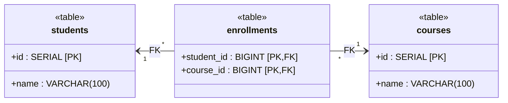
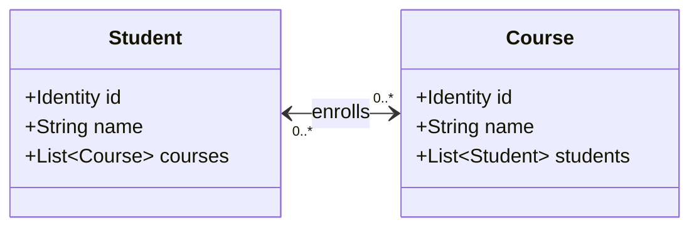
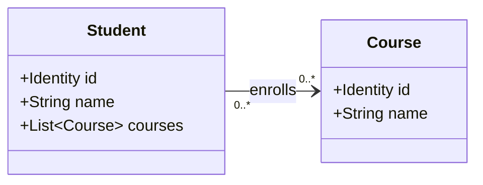
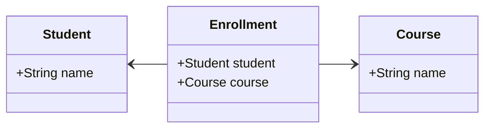

## はじめに

ドメインモデリングを学ぶ中で、エンティティ間の関連（リレーションシップ）の表現は、システムの保守性や拡張性に大きく影響すると実感しました。

## なぜ関連のモデリングが重要なのか？

関連の設計が不適切だと、次のような問題が発生します。

- 不変条件の検証が困難になり、データ整合性が保てない
- パフォーマンスの問題（N+1問題や過剰なメモリ使用）
- ドメインロジックの複雑化と保守性の低下
- 集約境界の破壊によるトランザクション管理の困難

データベースレベルでは、多対多の関連は交差テーブルを用いて表現されますが、ドメインモデルではより多様な表現方法があります。それぞれの設計選択は、パフォーマンス、メモリ使用量、コードの複雑性、ドメインロジックの表現力に異なる影響を与えます。

## スキーマ例

典型的な多対多リレーションのデータベーススキーマ例です。

```sql
-- 学生
CREATE TABLE students (
    id SERIAL NOT NULL,
    name VARCHAR(100) NOT NULL,
    PRIMARY KEY(id)
);

-- 講座
CREATE TABLE courses (
    id SERIAL NOT NULL,
    name VARCHAR(100) NOT NULL,
    PRIMARY KEY(id)
);

-- 履修
CREATE TABLE enrollments (
    student_id BIGINT NOT NULL,
    course_id BIGINT NOT NULL,
    PRIMARY KEY(student_id, course_id)
);
```



関連のモデリングにおける主要な論点は次の通りです：

- 関連のパリティ
- 関連付けるものはIDか実体か
- いつ関連を取得するか
- どうやって関連の変更を永続化するか

4は本来ドメインモデルの外にある論点ですが、方式によってはドメインモデル設計に影響するためここで扱います。

## 論点1: 関連のパリティ

例では「学生」と「講座」は多対多の関連があります。このとき、

- 学生の属性に講座のコレクションを持つか
- 講座の属性に学生のコレクションを持つか
- 双方向にコレクションを持たせるか
- どちらにも持たせないか

検討する必要があります。この選択はドメインロジックの表現力とシステムの複雑性のバランスに直接影響します。

### 参考文献

- Modeling Relationships in a DDD way
- Change Bidirectional Association to Unidirectional

### ① 双方向

record Student(
    Identity id,
    String name,
    List<Course> courses
) {}

record Course(
    Identity id,
    String name,
    List<Student> students
) {}



Pros:

- どちらのエンティティからでも関連先にアクセス可能
- ドメインロジックを自然に表現できる
- メモリ上にロードされていれば追加アクセスなしで辿れる

Cons:

- 両側の整合性を維持する必要があり更新が複雑
- 循環参照によりシリアライゼーションやEagerロードが困難
- メモリ使用量が増加

### ② 単方向

record Student(
    Identity id,
    String name,
    List<Course> courses
) {}

record Course(
    Identity id,
    String name
) {}



Pros:

- 実装がシンプルで整合性の維持が容易
- 循環参照が発生しない
- メモリ効率が良く依存関係が明確

Cons:

- 逆方向のナビゲーションには追加クエリが必要
- 集約ルートが明確でない場合がある

### ③ 関連の型を作る（交差エンティティ）

record Student(String name) {}
record Course(String name) {}
record Enrollment(Student student, Course course) {}



Pros:

- 関連に属性を持たせやすい（履修日時、成績など）
- 関連が必要ないユースケースも自然に表現可能

Cons:

- モデル数が増える
- 不変条件が型で表現しにくい

交差エンティティに属性がある場合はこのパターンで、属性がない場合は集約ルートを決めて単方向にするのがDDDでの一般的な基準です。

## 論点2: 実体かIDか

### ① 実体参照

record Student(
    Identity id,
    String name,
    List<Course> courses
) {}

record Course(
    Identity id,
    String name,
    List<Student> students
) {}

Pros:

- ドメインロジックが自然に表現できる
- 不変条件の検証が容易

Cons:

- 集約境界を越える場合トランザクション整合性が複雑
- メモリ使用量が大きい

### ② ID参照

record Student(
    Identity id,
    String name,
    List<Identity> courseIds
) {}

record Course(
    Identity id,
    String name,
    List<Identity> studentIds
) {}

Pros:

- 集約境界が明確
- メモリ効率が良い

Cons:

- 関連情報取得に追加クエリが必要
- ドメインの不変条件を表現しにくい

原則として、マイクロサービスや異なる集約間の関連はID参照を使い、同一集約内では実体参照を用います。

## 論点3: いつ関連を取得するか

### ① Eager Loading

生成時に全関連をロード

Pros: 不変条件検証が容易、アクセス高速、N+1回避

Cons: 大量データでメモリ/初期ロードが重い

### ② Nullable取得

必要な時に取得、未取得はnull

Pros: メモリ効率、初期ロード高速

Cons: 不変条件検証困難、null処理が必要

### ③ Lazy Load

初回アクセス時にロード

Pros: 必要時のみロード、透過的アクセス

Cons: 実装複雑、トランザクション外アクセス注意、永続化層依存

## 論点4: 関連の更新

### ① 即時反映方式

追加・削除時にSQL発行

Pros: 直感的、デバッグ容易

Cons: 永続化層と密結合、パフォーマンス懸念

### ② Unit of Work

変更を記録しcommit/flush時にまとめて反映

Pros: 複数変更まとめて反映、トランザクション管理容易

Cons: 実装複雑、永続化層依存

### ③ 差分検出方式

保存時に差分を抽出して反映

Pros: ドメインモデルは永続化意識不要、無駄更新回避

Cons: 差分検出ロジックが複雑、追加クエリ

### ④ DEL/INS方式

既存関連をDELETEしてからINSERT

Pros: 実装簡単、整合性保証

Cons: パフォーマンス懸念、履歴管理との相性悪い

## パターンの組み合わせ

現実的な組み合わせは以下に限られます：

- 双方向 - 実体参照 - Lazy Load - 即時反映/Unit of Work
- 双方向 - 実体参照 - Nullable - *
- 単方向 or 関連型 - * - Eager Load - 差分検出/DEL-INS

3の組み合わせが、ドメイン不変条件を保ちつつ永続化層に依存しない純粋なモデル構築に向いている、と感じています。

## イミュータブルデータモデルとリレーション

### リソースとリソース

#### 依存リレーションシップ: 片方のライフサイクルに依存

record Restaurant(Identity id, String name, List<Table> tables) {}
record Table(Identity id, int tableNumber, int capacity) {}

```java
void save(Restaurant restaurant) {
    updateRestaurant(restaurant);
    // 必要に応じてテーブルの更新を反映
}
```

#### 非依存リレーションシップ: 独立したライフサイクル、交差エンティティで表現

record User(Identity id, String name) {}
record Group(Identity id, String name) {}
record Membership(User user, Group group) {}

### イベントとリソース

#### イベント側にリソース参照を持たせる

record Order(Identity id, Customer customer, Product product, LocalDateTime orderedAt) {}

#### イベントの明細

イベントが明細を持つ場合は依存関係を保持

record Order(Identity id, Customer customer, List<OrderLine> lines, LocalDateTime orderedAt) {}
record OrderLine(Product product, int amount) {}

#### イベント間の関連

依存する側がIDを持つ。複数依存もIDリストで表現可能。

record Order(Identity id, LocalDateTime orderedAt) {}
record Invoice(Identity id, Identity orderId, LocalDateTime invoicedAt) {}

この整理により、関連モデリングの基本パターン、利点・欠点、組み合わせ方が明確になります。特にリソース間の非依存リレーションシップやイベント中心設計では、交差エンティティやID参照を活用することで、ドメインモデルの純粋性を保ちながら性能も確保できます。

